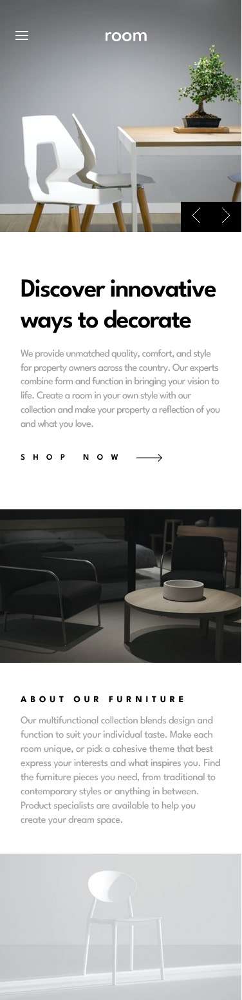
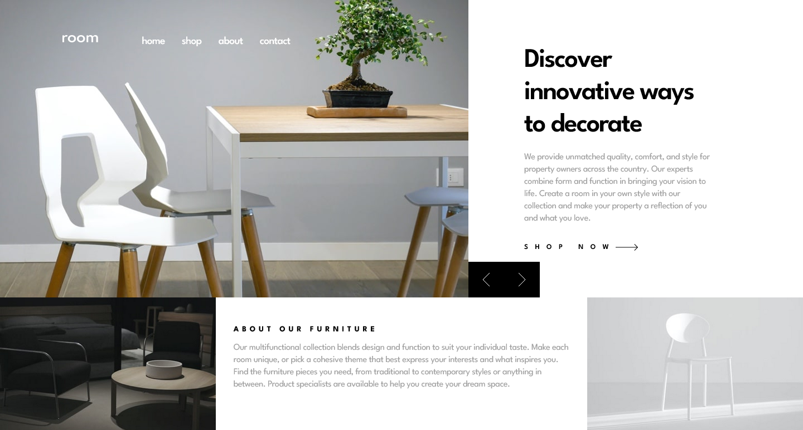

Room Ecommerce homepage solution

This is a solution to the [Room homepage Task](https://ecommerce-homepage-theta.vercel.app/). 

## Table of contents

- [Overview](#overview)
  - [The challenge](#the-challenge)
  - [Screenshot](#screenshot)
  - [Links](#links)
- [My process](#my-process)
  - [Built with](#built-with)
  - [What I learned](#what-i-learned)
  - [Continued development](#continued-development)
  - [Useful resources](#useful-resources)
- [Author](#author)
- [Acknowledgments](#acknowledgments)


## Overview

This project involves building the homepage for an e-commerce site "Room" using React with Typescript. The primary goal is to:
- Replicate the designs as close as possible
- Implement an image slider 
- Change displayed content based on change in image
- Be able to use the mouse/trackpad or keyboard to navigate the slider
- Hover effects for all interactive elements on the page

### The challenge

Users should be able to:

- View the optimal layout for the site depending on their device's screen size
- See hover states for all interactive elements on the page
- Navigate the slider using either their mouse/trackpad or keyboard

### Screenshot
#### Mobile View



#### Desktop View




### Links

- Solution URL: [The solution](https://github.com/nkweku66/ecommerce_homepage)
- Live Site URL: [The Room Homepage](https://ecommerce-homepage-theta.vercel.app/)

## My process

### Built with

- Semantic HTML5 markup
- Flexbox
- CSS Grid
- Mobile-first workflow
- [React](https://reactjs.org/) - JS library for building user interfaces
- [Typescript](https://www.typescriptlang.org/) - A typed superset of JavaScript
- [Vite](https://vitejs.dev/) - A build tool for modern JavaScript
- [Styled Components](https://styled-components.com/) - For styles


### What I learned

Throughout this project, I gained valuable experience and knowledge in several key areas:

1. Building React Applications:
  
I enhanced my skills in building React applications using JavaScript and improved significantly with TypeScript.

2. Working with Git Flow:

I learned how to effectively use the Git Flow approach for development, which helped me manage branches and streamline the development process.
Styling with Styled Components:

3. Instead of traditional CSS files, I utilized styled components for styling my React components, which offered a more modular and dynamic approach.

4. React Concepts:
I delved into the concepts of conditional rendering, useState, and useEffect.

5. Favorite Aspects:
I particularly enjoyed working with props in React and styled components, which allowed for flexible and reusable component designs.
Data-driven development in React was another aspect I found enjoyable and insightful.
Overall, this project was a fantastic learning experience that deepened my understanding of React and modern web development practices.

#### some code snippets:
```typescript
 const [isMenuClicked, setIsMenuClicked] = useState<boolean>(false)
```

### Continued development

Throughout the development there were a few parts that i fell short and would like to develop in those areas.
These areas are:
- the effective use of useState, useEffect, useRef and the other react hooks available
- Proper type handling
- Effective use of the git flow method of development

### Useful resources

- [React with Typescript](https://www.freecodecamp.org/news/use-typescript-with-react/) - This is an amazing article which helped me finally understand how to develop react application using typescript.

- [Styled Components](https://youtube.com/playlist?list=PLC3y8-rFHvwgu-G08-7ovbN9EyhF_cltM&si=EwttGaIo9EkpA3NK) - This helped me to understand the concept of styled components and how to use it.

- [Gitflow Workflow](https://www.atlassian.com/git/tutorials/comparing-workflows/gitflow-workflow#:~:text=Gitflow%20is%20an%20alternative%20Git,lived%20branches%20and%20larger%20commits.) - This is an amazing article which helped me understand gitflow workflow. 


## Author
##### Nana Obeng
- Github - [@nkweku66](https://github.com/nkweku66)
- Linkedin - [denakwob](https://www.linkedin.com/in/denakwob/)
- Twitter - [@nadeob](https://www.x.com/nadeobeng)


## Acknowledgments

I will like to first thank Amalitech for putting me on this path of self paced timed learning. It has helped me to come out of my shell to get this work done and for such i have learnt a lot. I will also like to acknowledge Mr edem who helped me to get some concepts in place and simple to understand.